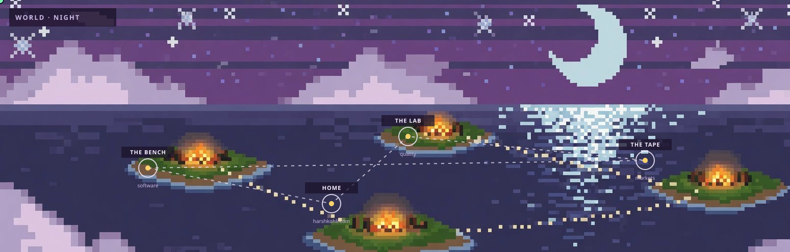
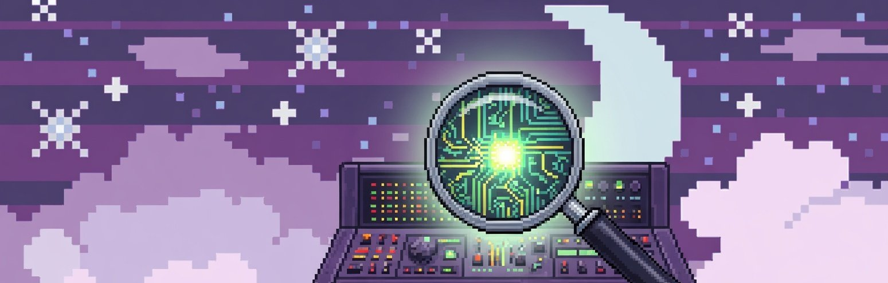
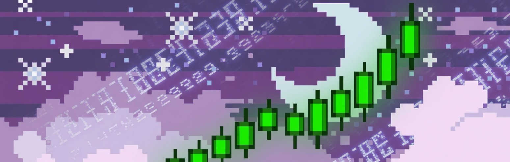

<div align="center">
  
  
  <a href="https://harshkohli.com">
    
  </a>
  
</div>

<br />

<div align="center">

[](https://harshkohli.com)
[](mailto:send@harshkohli.com)
[](https://x.com/riootly)
[](https://twitch.tv/iitzHarsh)
[](https://reddit.com/user/riotly)
[](https://discord.com/users/riotly)

<br />


</div>


<div align="center">
  
</div>


<div align="center">
  
</div>


<div align="center">
  
</div>


### Rooms

<table>
  <tr>
    <td width="33%" valign="top">
      
      <p align="center"><b>SOFTWARE</b><br/>I write it<br/><sub>Clear over clever. If it has to stay up, I treat it that way.</sub></p>
    </td>
    <td width="33%" valign="top">
      
      <p align="center"><b>QUALITY</b><br/>I break it first<br/><sub>Senior QA. Walk the path a real player walks, not the one in the ticket.</sub></p>
    </td>
    <td width="33%" valign="top">
      
      <p align="center"><b>MARKETS</b><br/>I watch the tape<br/><sub>Crypto and the rails under it. Learned by using it, not by collecting threads.</sub></p>
    </td>
  </tr>
</table>


<div align="center">
  
</div>

### Now

```text
[x] building harshkohli.com
[x] senior QA. releases, edge cases, the last five percent
[x] trading, reading the tape, writing small things that help me see it clearer
[ ] if I cannot read it next month, it is not done
```

### Loadout

<p align="center">
  
  
  
  
  
  
  
  <br />
  
  
  
  
  
  
  
</p>


<div align="center">
  
</div>


### GitHub

<div align="center">
  
  
</div>

<br />

<div align="center">
  
</div>

<br />

<div align="center">
  <picture>
    <source media="(prefers-color-scheme: dark)" srcset="https://raw.githubusercontent.com/Riotly/riotly/output/github-contribution-grid-snake-dark.svg" />
    <source media="(prefers-color-scheme: light)" srcset="https://raw.githubusercontent.com/Riotly/riotly/output/github-contribution-grid-snake.svg" />
    
  </picture>
</div>


<div align="center">

**Harsh Kohli** &nbsp;·&nbsp; `@Riotly`

[harshkohli.com](https://harshkohli.com) &nbsp;·&nbsp; [send@harshkohli.com](mailto:send@harshkohli.com) &nbsp;·&nbsp; [X](https://x.com/riootly) &nbsp;·&nbsp; [Twitch](https://twitch.tv/iitzHarsh) &nbsp;·&nbsp; [PayPal](https://paypal.me/harshkoohli)

<br />

<sub>if I cannot read it next month, it is not done.</sub>

</div>
