<div align="center">
  
  
</div>

<br />

<div align="center">

[](https://harshkohli.com)
[](mailto:send@harshkohli.com)
[](https://x.com/riootly)
[](https://twitch.tv/iitzHarsh)
[](https://reddit.com/user/riotly)
[](https://discord.com/users/riotly)

<br />


</div>

---

### About

I'm **Harsh Kohli**. I write software, I test it like it matters, and I keep learning the systems underneath — including the ones that move money.

First computer in **2015**. Started shipping for real in **2022**. Joined **Badlion Client** in **2023**, Senior QA in **2024**. Still at the bench.

Building things that make sense, and sometimes even feel beautiful.

<p align="center">
  <a href="https://harshkohli.com"><strong>harshkohli.com</strong></a> &nbsp;·&nbsp; Uttar Pradesh, India &nbsp;·&nbsp; <code>@Riotly</code>
</p>

---

### What I do

| Software | Quality | Markets |
| :-- | :-- | :-- |
| **I write it** | **I break it first** | **I watch the tape** |
| Sites, tools, client work. If it has to stay up, I treat it that way. Clear over clever. | Senior QA on [Badlion Client](https://badlion.net) — a large Minecraft client, a lot of people hitting the same buttons at the same time. | Crypto and the rails under it. I learned this by using it, not by collecting threads. |

---

### Now

- Building [harshkohli.com](https://harshkohli.com)
- Senior QA at **Badlion Client**
- Trading, reading the tape, writing small things that help me see it clearer

---

### Stack

<p align="center">
  
  
  
  
  
  
  
  <br />
  
  
  
  
  
  
  
</p>

---

### Journey

```text
2015   first computer. countless hours exploring how the machine actually works
2022   stepped into real software. started shipping
2023   joined Badlion Client
2024   Senior QA — releases, edge cases, the last five percent
2025   deepest year at the bench so far
2026   opened the door to markets. still writing. still asking what happens if you press it twice
```

---

### GitHub

<div align="center">
  
  
</div>

<br />

<div align="center">
  
</div>

<br />

<div align="center">
  <picture>
    <source media="(prefers-color-scheme: dark)" srcset="https://raw.githubusercontent.com/Riotly/riotly/output/github-contribution-grid-snake-dark.svg" />
    <source media="(prefers-color-scheme: light)" srcset="https://raw.githubusercontent.com/Riotly/riotly/output/github-contribution-grid-snake.svg" />
    
  </picture>
</div>

---

<div align="center">

**Harsh Kohli** &nbsp;·&nbsp; `@Riotly`

[harshkohli.com](https://harshkohli.com) &nbsp;·&nbsp; [send@harshkohli.com](mailto:send@harshkohli.com) &nbsp;·&nbsp; [X](https://x.com/riootly) &nbsp;·&nbsp; [Twitch](https://twitch.tv/iitzHarsh) &nbsp;·&nbsp; [PayPal](https://paypal.me/harshkoohli)

<br />

<sub>If I cannot read it next month, it is not done.</sub>

</div>
